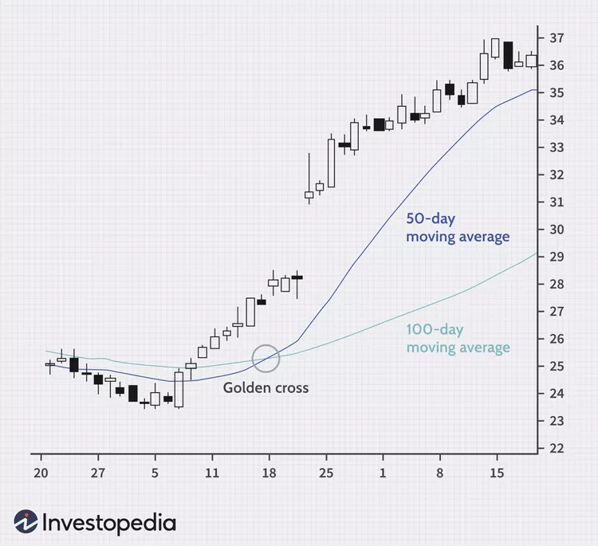
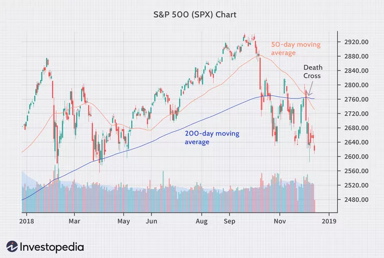

# Crossover

- What Is a Crossover?
The crossover is a point on the trading chart in which a security's price and a technical indicator line intersect, or when two indicators themselves cross. Crossovers are used to estimate the performance of a financial instrument and to predict coming changes in trend, such as reversals or breakouts.

Common examples include the golden cross and death cross, which look for crossovers in different moving averages.

- Key Takeaways
A crossover refers to an instance where an indicator and a price, or multiple indicators, overlap and cross one another.
Crossovers are used in technical analysis to confirm patterns and trends such as reversals and breakouts, generating buy or sell signals accordingly.
Moving average crossovers are common, including the death cross and golden cross.

## Golden Cross
The golden cross is a candlestick pattern that is a bullish signal in which a relatively short-term moving average crosses above a long-term moving average. The golden cross is a bullish breakout pattern formed from a crossover involving a security's short-term moving average (such as the 15-day moving average) breaking above its long-term moving average (such as the 50-day moving average) or resistance level. As long-term indicators carry more weight, the golden cross indicates a bull market on the horizon and is reinforced by high trading volumes. The opposite of a golden cross is a death cross.

## Death Cross
- What Is a Death Cross?
The "death cross" is a market chart pattern reflecting recent price weakness. It refers to the drop of a short-term moving average—meaning the average of recent closing prices for a stock, stock index, commodity, or cryptocurrency over a set period of time—below a longer-term moving average. The most closely watched stock-market moving averages are the 50-day and the 200-day.

Despite its ominous name, the death cross is not a market milestone worth dreading. Market history suggests it tends to precede a near-term rebound with above-average returns.

- Key Takeaways
The death cross appears on a chart when a stock’s short-term moving average, usually the 50-day, crosses below its long-term moving average, usually the 200-day.
Despite the dramatic name, the death cross has been followed by above-average short-term returns many times since 1992.1
The rise of the 50-day moving average above the 200-day moving average is known as a golden cross and can signal the exhaustion of downward market momentum.
