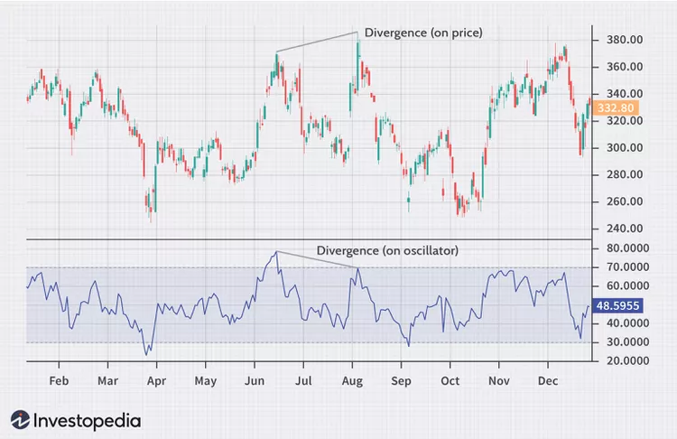

# Divergence
Divergence is when the price of an asset is moving in the opposite direction of a technical indicator, such as an oscillator, or is moving contrary to other data. Divergence warns that the current price trend may be weakening, and in some cases may lead to the price changing direction.1

There is positive and negative divergence. Positive divergence indicates a move higher in the price of the asset is possible. Negative divergence signals that a move lower in the asset is possible.

Divergence can occur between the price of an asset and almost any technical or fundamental indicator or data. Though, divergence is typically used by technical traders when the price is moving in the opposite direction of a technical indicator.
Positive divergence signals price could start moving higher soon. It occurs when the price is moving lower but a technical indicator is moving higher or showing bullish signals.
Negative divergence points to lower prices in the future. It occurs when the price is moving higher but a technical indicator is moving lower or showing bearish signals.
Divergence isn't to be relied on exclusively, as it doesn't provide timely trade signals. Divergence can last a long time without a price reversal occurring.
Divergence is not present for all major price reversals, it is only present on some.