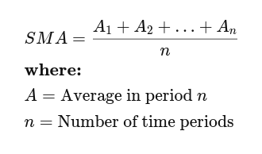
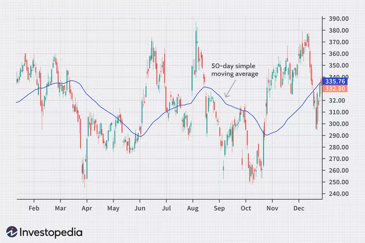
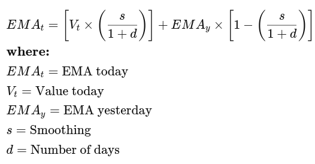
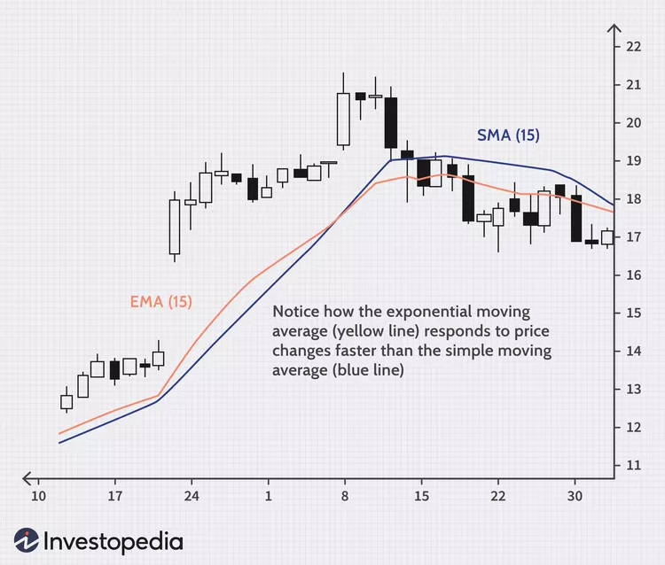

# MA (Moving Average)

What Is a Moving Average (MA)?
In finance, a moving average (MA) is a stock indicator commonly used in technical analysis. The reason for calculating the moving average of a stock is to help smooth out the price data by creating a constantly updated average price.

By calculating the moving average, the impacts of random, short-term fluctuations on the price of a stock over a specified time frame are mitigated. Simple moving averages (SMAs) use a simple arithmetic average of prices over some timespan, while exponential moving averages (EMAs) place greater weight on more recent prices than older ones over the time period.

Key Takeaways
A moving average (MA) is a stock indicator commonly used in technical analysis.
The moving average helps to level the price data over a specified period by creating a constantly updated average price.
A simple moving average (SMA) is a calculation that takes the arithmetic mean of a given set of prices over a specific number of days in the past.
An exponential moving average (EMA) is a weighted average that gives greater importance to the price of a stock in more recent days, making it an indicator that is more responsive to new information.
Moving Average
Investopedia / Yurle Villegas

Understanding a Moving Average (MA)
Moving averages are calculated to identify the trend direction of a stock or to determine its support and resistance levels. It is a trend-following or lagging indicator because it is based on past prices.

The longer the period for the moving average, the greater the lag. A 200-day moving average will have a much greater degree of lag than a 20-day MA because it contains prices for the past 200 days. Fifty-day and 200-day moving average figures are widely followed by investors and traders and are considered to be important trading signals.

Investors may choose different periods of varying lengths to calculate moving averages based on their trading objectives. Shorter moving averages are typically used for short-term trading, while longer-term moving averages are more suited for long-term investors.

While it is impossible to predict the future movement of a specific stock, using technical analysis and research can help make better predictions. A rising moving average indicates that the security is in an uptrend, while a declining moving average indicates that it is in a downtrend.

Similarly, upward momentum is confirmed with a bullish crossover, which occurs when a short-term moving average crosses above a longer-term moving average. Conversely, downward momentum is confirmed with a bearish crossover, which occurs when a short-term moving average crosses below a longer-term moving average.

Types of Moving Averages
Simple Moving Average
A simple moving average (SMA) is calculated by taking the arithmetic mean of a given set of values over a specified period. A set of numbers, or prices of stocks, are added together and then divided by the number of prices in the set. The formula for calculating the simple moving average of a security is as follows:

 
where:
A=Average in period n
n=Number of time periods
​

Charting stock prices over 50 days using a simple moving average may look like this:

Charting a 50-Day Simple Moving Average.
MA-Image by Sabrina Jiang © Investopedia 2021

Exponential Moving Average (EMA)
The exponential moving average gives more weight to recent prices in an attempt to make them more responsive to new information. To calculate an EMA, the simple moving average (SMA) over a particular period is calculated first.

Then calculate the multiplier for weighting the EMA, known as the "smoothing factor," which typically follows the formula: [2/(selected time period + 1)]. 

For a 20-day moving average, the multiplier would be [2/(20+1)]= 0.0952. The smoothing factor is combined with the previous EMA to arrive at the current value. The EMA thus gives a higher weighting to recent prices, while the SMA assigns an equal weighting to all values.

Simple Moving Average (SMA) vs. Exponential Moving Average (EMA)
The calculation for EMA puts more emphasis on the recent data points. Because of this, EMA is considered a weighted average calculation.

In the figure below, the number of periods used in each average is 15, but the EMA responds more quickly to the changing prices than the SMA. The EMA has a higher value when the price is rising than the SMA and it falls faster than the SMA when the price is declining. This responsiveness to price changes is the main reason why some traders prefer to use the EMA over the SMA.

Example of a Moving Average
The moving average is calculated differently depending on the type: SMA or EMA. Below, we look at a simple moving average (SMA) of a security with the following closing prices over 15 days:

Week 1 (5 days): 20, 22, 24, 25, 23
Week 2 (5 days): 26, 28, 26, 29, 27
Week 3 (5 days): 28, 30, 27, 29, 28
A 10-day moving average would average out the closing prices for the first 10 days as the first data point. The next data point would drop the earliest price, add the price on day 11, and take the average.

Example of a Moving Average Indicator
A Bollinger Band® technical indicator has bands generally placed two standard deviations away from a simple moving average. In general, a move toward the upper band suggests the asset is becoming overbought, while a move close to the lower band suggests the asset is becoming oversold. Since standard deviation is used as a statistical measure of volatility, this indicator adjusts itself to market conditions.

What Does a Moving Average Indicate?
A moving average is a statistic that captures the average change in a data series over time. In finance, moving averages are often used by technical analysts to keep track of price trends for specific securities. An upward trend in a moving average might signify an upswing in the price or momentum of a security, while a downward trend would be seen as a sign of decline.

What Are Moving Averages Used for?
Moving averages are widely used in technical analysis, a branch of investing that seeks to understand and profit from the price movement patterns of securities and indices. Generally, technical analysts will use moving averages to detect whether a change in momentum is occurring for a security, such as if there is a sudden downward move in a security’s price. Other times, they will use moving averages to confirm their suspicions that a change might be underway.

What Are Some Examples of Moving Averages?
The exponential moving average (EMA) is a type of moving average that gives more weight to more recent trading days. This type of moving average might be more useful for short-term traders for whom longer-term historical data might be less relevant. A simple moving average is calculated by averaging a series of prices while giving equal weight to each of the prices involved.

What Is MACD?
Traders use the moving average convergence divergence (MACD) to monitor the relationship between two moving averages, calculated by subtracting a 26-day exponential moving average from a 12-day exponential moving average. The MACD also employs a signal line that helps identify crossovers, which is a nine-day exponential moving average of the MACD line plotted on the same graph.

The signal line is used to help identify trend changes in the price of a security and to confirm the trend's strength.  When the MACD is positive, the short-term average is located above the long-term average and is an indication of upward momentum. When the short-term average is below the long-term average, it's a sign that the momentum is downward.

What Is a Golden Cross?
A golden cross is a chart pattern in which a short-term moving average crosses above a long-term moving average. The golden cross is a bullish breakout pattern formed from a crossover involving a security's short-term moving average such as the 15-day moving average, breaking above its long-term moving average, such as the 50-day moving average. As long-term indicators carry more weight, the golden cross indicates a bull market on the horizon and is reinforced by high trading volumes.

The Bottom Line
A moving average (MA) is a stock indicator commonly used in technical analysis, used to help smooth out price data by creating a constantly updated average price. A rising moving average indicates that the security is in an uptrend, while a declining moving average indicates a downtrend.

The exponential moving average is generally preferred to a simple moving average as it gives more weight to recent prices and shows a clearer response to new information and trends.