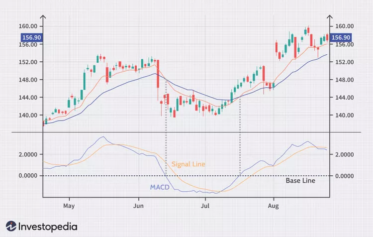
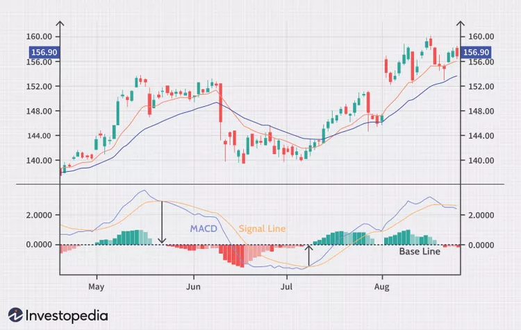
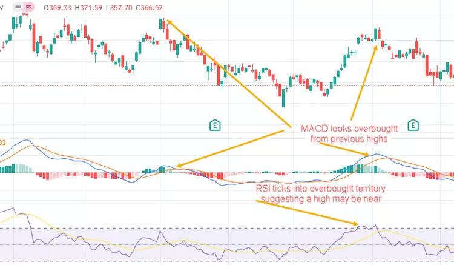

Moving average convergence/divergence (MACD) is a technical indicator to help investors identify price trends, measure trend momentum, and identify entry points for buying or selling. Moving average convergence/divergence (MACD) is a trend-following momentum indicator that shows the relationship between two exponential moving averages (EMAs) of a security’s price. MACD was developed in the 1970s by Gerald Appel, and is one of the most popular technical tools, readily available on most trading platforms offered by online stock brokers.1

Key Takeaways
Moving average convergence/divergence (MACD) is a technical indicator to help investors identify entry points for buying or selling.
The MACD line is calculated by subtracting the 26-period exponential moving average (EMA) from the 12-period EMA.
The signal line is a nine-period EMA of the MACD line.
MACD is best used with daily periods, where the traditional settings of 26/12/9 days is the default.
Moving Average Convergence/Divergence (MACD)
Xiaojie Liu / Investopedia

What MACD Signals
The MACD line is calculated by subtracting the 26-period EMA from the 12-period EMA. The calculation creates the MACD line. A nine-day EMA of the MACD line is called the signal line, plotted on top of the MACD line, which can function as a trigger for buy or sell signals.

Traders may buy the security when the MACD line crosses above the signal line and sell—or short—the security when the MACD line crosses below the signal line. MACD indicators can be interpreted in several ways, but the more common methods are crossovers, divergences, and rapid rises/falls.

MACD Formula
MACD
=
12-Period EMA 
−
 26-Period EMA
MACD=12-Period EMA − 26-Period EMA

MACD is calculated by subtracting the long-term EMA (26 periods) from the short-term EMA (12 periods). An EMA is a moving average (MA) that places a greater weight and significance on the most recent data points.

Using MACD
MACD has a positive value (shown as the blue line on the MACD chart) whenever the 12-period EMA (indicated by the red line on the price chart) is above the 26-period EMA (the blue line in the price chart), and a negative value when the 12-period EMA is below the 26-period EMA. The distance between MACD and its baseline depends on the distance between the two EMAs.

As shown in the chart below, rises and drops in MACD (blue) values correspond to the movements of the two EMA lines.

MACD is often displayed with a histogram (see the next chart below) that graphs the distance between MACD and its signal line. If MACD is above the signal line, the histogram will be above the MACD’s baseline or zero line. If MACD is below its signal line, the histogram will be below the MACD’s baseline. Traders use the MACD’s histogram to identify peaks of bullish or bearish momentum, and to generate overbought/oversold trade signals.

MACD vs. Relative Strength
The relative strength index (RSI) signals whether an instrument is considered overbought or oversold based on its recent price action. The RSI is an oscillator that calculates the average price gains and losses over a given period. The default is 14 periods with values bounded from 0 to 100. A reading above 70 suggests an overbought condition, while a reading below 30 is considered oversold, with both potentially signaling a top or a bottom is forming.

Unlike the RSI or other oscillator studies, the MACD lines do not have concrete overbought/oversold levels. Rather, they function on a relative basis. An investor or trader should focus on the level and direction of the MACD/signal lines compared with preceding price movements in the security at hand, as shown below.

MACD divergence
MACD measures the relationship between two EMAs to indicate momentum and potential trade reversals, while the RSI seeks out overbought and oversold conditions by evaluating recent price action. These indicators are often used together to give analysts a more complete technical picture.

Both measure the momentum of an instrument, but they measure different factors. The two can sometimes give contradictory results. The RSI may show a reading above 70 (overbought) for a sustained period, indicating an instrument is overextended to the buy side. In contrast, the MACD may indicate that the instrument’s buy-side momentum is still growing. Either indicator may signal an upcoming trend change by showing divergence from price (price continues higher while the indicator turns lower, or vice versa).