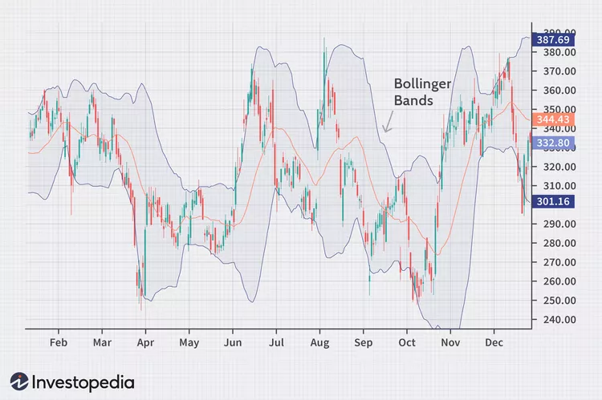
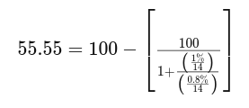

# RSI

What Is the Relative Strength Index (RSI)?
The relative strength index (RSI) is a momentum indicator used in technical analysis. RSI measures the speed and magnitude of a security's recent price changes to detect overvalued or undervalued conditions in the price of that security.

The RSI is displayed as an oscillator (a line graph) on a scale of zero to 100. The indicator was developed by J. Welles Wilder Jr. and introduced in his seminal 1978 book, New Concepts in Technical Trading Systems.

In addition to identifying overbought and oversold securities, the RSI can also indicate securities that may be primed for a trend reversal or a corrective pullback in price. It can signal when to buy and sell. Traditionally, an RSI reading of 70 or above indicates an overbought condition. A reading of 30 or below indicates an oversold condition.

The RSI is one of the most popular technical indicators, and it is generally available on most trading platforms offered by online stock brokers.

- Key Takeaways
The relative strength index (RSI) is a popular momentum oscillator introduced in 1978.
The RSI provides technical traders with signals about bullish and bearish price momentum, and is often plotted below the graph of an asset’s price.
An asset is usually considered overbought when the RSI is above 70 and oversold when it is below 30.
The RSI line crossing below the overbought line or above the oversold line can be seen by traders as a signal to buy or sell.
The RSI works best in trading ranges rather than trending markets.
How the Relative Strength Index (RSI) Works
As a momentum indicator, the relative strength index compares a security's strength on days when prices go up to its strength on days when prices go down. Relating the result of this comparison to price action can give traders an idea of how a security may perform.

The RSI, used in conjunction with other technical indicators, can help traders make better-informed trading decisions.

Take the Next Step to Invest
Advertiser Disclosure

- Calculating RSI
The RSI uses a two-part calculation that starts with the following formula:

The average gain or loss used in this calculation is the average percentage gain or loss during a look-back period. The formula uses a positive value for the average loss.

Periods with price losses are counted as zero in the calculations of average gain. Periods with price increases are counted as zero in the calculations of average loss.

The standard number of periods used to calculate the initial RSI value is 14.

For example, imagine the market closed higher seven out of the past 14 days with an initial average gain of 1%. The remaining seven days all closed lower with an initial average loss of −0.8%.

The first calculation for the RSI would look like the following expanded calculation:

Once there are 14 periods of data available, the second calculation can be done. Its purpose is to smooth the results so that the RSI only nears 100 or zero in a strongly trending market.

- Plotting RSI
After the RSI is calculated, the RSI indicator can be plotted, usually beneath an asset’s price chart, as shown below. The RSI will rise as the number and size of up days increase. It will fall as the number and size of down days increase.

Image shows a candlestick chart in the top panel, with RSI plotted in the lower panel. 

As you can see in the above chart, the RSI indicator can stay in the overbought region for extended periods while the stock is in an uptrend. The indicator may also remain in oversold territory for a long time when the stock is in a downtrend. This can be confusing for new analysts, but learning to use the indicator within the context of the prevailing trend will clarify these issues.

- Why Is RSI Important?
Traders can use RSI to predict the price behavior of a security.
It can help traders validate trends and trend reversals.
It can point to overbought and oversold securities.
It can provide short-term traders with buy and sell signals.
It's a technical indicator that can be used with others to support trading strategies.
- Using RSI With Trends
Modify RSI Levels to Fit Trends
The primary trend of the security is important to know to properly understand RSI readings. For example, well-known market technician Constance Brown, CMT, proposed that an oversold reading by the RSI in an uptrend is probably much higher than 30. Likewise, an overbought reading during a downtrend is much lower than 70.

Constance M. Brown. "Technical Analysis for the Trading Professional," Pages 6-9. McGraw Hill Professional, 2011.

As you can see in the following chart, during a downtrend, the RSI peaks near 50 rather than 70. This could be seen by traders as more reliably signaling bearish conditions.

Many investors create a horizontal trendline between the levels of 30 and 70 when a strong trend is in place to better identify the overall trend and extremes.

On the other hand, modifying overbought or oversold RSI levels when the price of a stock or asset is in a long-term horizontal channel or trading range (rather than a strong upward or downward trend) is usually unnecessary.

The relative strength indicator is not as reliable in trending markets as it is in trading ranges. In fact, most traders understand that the signals given by the RSI in strong upward or downward trends often can be false.

Use Buy and Sell Signals That Fit Trends
A related concept focuses on trade signals and techniques that conform to the trend. In other words, using bullish signals primarily when the price is in a bullish trend and bearish signals primarily when a stock is in a bearish trend may help traders avoid the false alarms that the RSI can generate in trending markets.

Image shows a candlestick chart in the top panel, with RSI plotted in the lower panel. 

- Overbought or Oversold
Generally, when the RSI indicator crosses 30 on the RSI chart, it is a bullish sign and when it crosses 70, it is a bearish sign. Put another way, one can interpret that RSI values of 70 or above indicate that a security is becoming overbought or overvalued. It may be primed for a trend reversal or corrective price pullback. An RSI reading of 30 or below indicates an oversold or undervalued condition.

Overbought refers to a security that trades at a price level above its true (or intrinsic) value. That means that it's priced above where it should be, according to practitioners of either technical analysis or fundamental analysis. Traders who see indications that a security is overbought may expect a price correction or trend reversal. Therefore, they may sell the security.

The same idea applies to a security that technical indicators such as the relative strength index highlight as oversold. It can be seen as trading at a lower price than it should. Traders watching for just such an indication might expect a price correction or trend reversal and buy the security.

- Interpretation of RSI and RSI Ranges
During trends, the RSI readings may fall into a band or range. During an uptrend, the RSI tends to stay above 30 and should frequently hit 70. During a downtrend, it is rare to see the RSI exceed 70. In fact, the indicator frequently hits 30 or below.

These guidelines can help traders determine trend strength and spot potential reversals. For example, if the RSI can’t reach 70 on a number of consecutive price swings during an uptrend, but then drops below 30, the trend has weakened and could be reversing lower. 

The opposite is true for a downtrend. If the downtrend is unable to reach 30 or below and then rallies above 70, that downtrend has weakened and could be reversing to the upside. Trend lines and moving averages are helpful technical tools to include when using the RSI in this way.

Be sure not to confuse RSI and relative strength. The first refers to changes in the price momentum of one security. The second compares the price performance of two or more securities.

- Example of RSI Divergences
An RSI divergence occurs when price moves in the opposite direction of the RSI. In other words, a chart might display a change in momentum before a corresponding change in price.

A bullish divergence occurs when the RSI displays an oversold reading followed by a higher low that appears with lower lows in the price. This may indicate rising bullish momentum, and a break above oversold territory could be used to trigger a new long position.

A bearish divergence occurs when the RSI creates an overbought reading followed by a lower high that appears with higher highs on the price.

As you can see in the following chart, a bullish divergence was identified when the RSI formed higher lows as the price formed lower lows. This was a valid signal, but divergences can be rare when a stock is in a stable long-term trend. Using flexible oversold or overbought readings will help identify more potential signals.

Image shows a candlestick chart in the top panel, with RSI plotted in the lower panel. 

## in conjuction with other indicators

How Does the RSI Work?
RSI readings range from zero to 100, with readings above 70 generally interpreted as indicating overbought conditions and readings below 30 indicating oversold conditions. Since the RSI measures the magnitude of recent price movements, it is prone to generating false signals following sudden, sizable price changes.

Generally, as an asset's price rises, the RSI will rise as well because average gains will outstrip average losses. When the asset price falls, losses typically outstrip gains, causing the indicator to fall.

Calculating RSI is usually very time-consuming. However, RSI is popular enough that charting websites and software programs will frequently do all the math and create easy-to-interpret graphs.

- Moving Average Convergence Divergence (MACD)
One technical indicator that can be used in conjunction with the RSI and helps confirm the validity of RSI indications is another widely-used momentum indicator, the moving average convergence divergence (MACD). This indicator calculates momentum differently from the RSI by comparing the relative positions of a short- and long-term moving average.

Traders primarily monitor the MACD for signs of momentum diverging from price. 
While the price may continue to move up, with the RSI maintaining overbought readings for quite some time, the MACD shows divergence by beginning to turn down as the price continues to advance. That provides an additional indication confirming that a market may be reaching a level where it is overextended and, therefore, likely to retrace soon.

The MACD and RSI are both contrarians by design. They go against popular opinion by signaling to buy when there is a lot of selling and signaling to sell when there is significant buying. When both indicate buying, then the security is more likely to be genuinely oversold. Similarly, the security is probably overbought and headed downward when both RSI and MACD generate sell signals.

- Moving Average Crossovers
Moving average crossovers can also be used to confirm RSI indications that a market is overbought or oversold. RSI is often used to obtain an early sign of possible trend changes. Therefore, adding exponential moving averages (EMAs) that respond more quickly to recent price changes can help.

Relatively short-term moving average crossovers, such as the 5 EMA crossing over the 10 EMA, are best suited to complement RSI. 
The 5 EMA crossing from above to below the 10 EMA confirms the RSI's indication of overbought conditions and possible trend reversal. 
Conversely, an upside crossover provides an additional indication that a market might be oversold.
