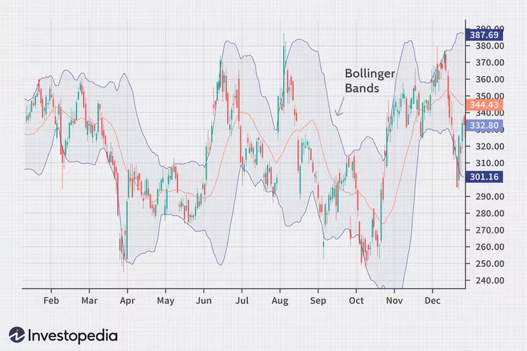

**Bollinger Bands** are a popular technical analysis tool used in algorithmic trading to measure market volatility and identify potential trading opportunities. Created by John Bollinger in the 1980s, Bollinger Bands consist of a set of three lines plotted in relation to a security's price:

it helps investors and traders gauge market volatility and identify when securities are poised to rise or fall.

Bollinger Bands, a popular tool among investors and traders, helps gauge the volatility of stocks and other securities to determine if they are over- or undervalued. Developed in the 1980s by financial analyst John Bollinger, the bands appear on stock charts as three lines that move with the price. The center line is the stock price's 20-day simple moving average (SMA). The upper and lower bands are set at a certain number of standard deviations, usually two, above and below the middle line.

The bands widen when a stock's price becomes more volatile and contract when it is more stable. Many traders see stocks as overbought as their price nears the upper band and oversold as they approach the lower band, signaling an opportune time to trade.

While valuable, Bollinger Bands are a secondary indicator that is best used to confirm other analysis methods. 

**Key Takeaways**
* Bollinger Bands is a technical analysis tool used to determine where prices are high and low relative to each other.
* These bands are composed of three lines: a simple moving average (the middle band) and an upper and lower band.
* The upper and lower bands are typically two standard deviations above or below a 20-period simple moving average (SMA).
* The bands widen and narrow as the volatility of the underlying asset changes.

1. **Middle Band:** Typically a simple moving average (SMA) of the security's price, usually over 20 periods.
2. **Upper Band:** Calculated by adding a multiple (usually two) of the standard deviation to the middle band.
3. **Lower Band:** Calculated by subtracting the same multiple of the standard deviation from the middle band.

These bands expand and contract in response to market volatility, providing visual cues about the price's relative position within its recent trading range.

---

### **Key Components of Bollinger Bands:**

1. **Middle Band (Moving Average):**
   - Acts as a baseline reflecting the average price over a specified period.
   - Commonly a 20-period SMA but can be adjusted based on the trading strategy.

2. **Upper and Lower Bands:**
   - Positioned two standard deviations above and below the middle band.
   - The standard deviation measures the price's variability, so the bands widen during high volatility and narrow during low volatility.

---

### **Calculating Bollinger Bands:**

1. **Calculate the Middle Band (MB):**
   \[
   MB = \text{Simple Moving Average (SMA)}(n)
   \]
   Where \( n \) is the number of periods.

2. **Calculate the Standard Deviation (SD):**
   \[
   SD = \sqrt{\frac{\sum_{i=1}^{n} (P_i - MB)^2}{n}}
   \]
   Where \( P_i \) is the price at period \( i \).

3. **Calculate the Upper Band (UB) and Lower Band (LB):**
   \[
   UB = MB + (k \times SD)
   \]
   \[
   LB = MB - (k \times SD)
   \]
   Where \( k \) is the number of standard deviations (typically \( k = 2 \)).

---

### **Interpretation in Algorithmic Trading:**

1. **Volatility Measurement:**
   - **Band Width:** The distance between the upper and lower bands indicates market volatility.
     - **Wide Bands:** High volatility.
     - **Narrow Bands:** Low volatility.

2. **Price Action Relative to Bands:**
   - **Touching or Breaking Upper Band:**
     - May indicate that the asset is overbought.
     - Potential signal to sell or short.
   - **Touching or Breaking Lower Band:**
     - May indicate that the asset is oversold.
     - Potential signal to buy or go long.

3. **Trend Identification:**
   - **Uptrends:**
     - Price consistently touches or moves along the upper band.
   - **Downtrends:**
     - Price consistently touches or moves along the lower band.

4. **Reversal Signals:**
   - **Double Bottoms/Tops within Bands:**
     - Can signal potential trend reversals.

---

### **Common Bollinger Band Strategies:**

1. **Bollinger Band Squeeze:**
   - **Description:**
     - Occurs when the bands become very narrow, indicating low volatility.
     - Suggests a potential breakout in either direction.
   - **Trading Approach:**
     - Prepare for increased volatility and a possible sharp move.
     - Use additional indicators (e.g., volume, momentum) to determine direction.

2. **Bollinger Band Breakouts:**
   - **Description:**
     - When price moves outside the bands, indicating extreme market conditions.
   - **Trading Approach:**
     - **Continuation:** A strong move outside the bands may continue in the same direction.
     - **Reversal:** Alternatively, it could signify an overextended market poised for reversal.
     - **Note:** Bollinger Bands do not provide direction; use in conjunction with other indicators.

3. **Mean Reversion:**
   - **Description:**
     - Prices tend to revert to the mean (middle band).
   - **Trading Approach:**
     - Buy when price touches the lower band and starts to move up.
     - Sell when price touches the upper band and starts to move down.
     - **Risk:** In trending markets, mean reversion strategies can underperform.

4. **Band Riding:**
   - **Description:**
     - In strong trends, prices can 'ride' the upper or lower band.
   - **Trading Approach:**
     - Stay in the trade as long as the price follows the band.
     - Use trailing stops to protect gains.

---

### **Implementing Bollinger Bands in Algorithmic Trading:**

1. **Algorithm Development:**
   - **Signal Generation:**
     - Define clear entry and exit rules based on band interactions.
   - **Parameter Optimization:**
     - Adjust the moving average period and standard deviation multiplier to suit the asset and timeframe.
   - **Integration with Other Indicators:**
     - Use in conjunction with RSI, MACD, or volume indicators to filter false signals.

2. **Risk Management:**
   - **Stop-Loss Orders:**
     - Set stop-loss levels beyond recent highs/lows or at a fixed percentage.
   - **Position Sizing:**
     - Adjust trade sizes based on volatility indicated by band width.

3. **Backtesting and Optimization:**
   - **Historical Testing:**
     - Validate the strategy over historical data to assess performance.
   - **Walk-Forward Analysis:**
     - Test strategy robustness over different time periods and market conditions.

4. **Automation and Execution:**
   - **Algorithmic Execution:**
     - Implement automated order placement when signals are generated.
   - **Monitoring and Adjustment:**
     - Continuously monitor performance and adjust parameters as necessary.

---

### **Advantages of Using Bollinger Bands:**

- **Adaptability to Market Conditions:**
  - Automatically adjusts to volatility changes.
- **Simplicity:**
  - Easy to understand and implement.
- **Versatility:**
  - Applicable to various assets and timeframes.
- **Combination with Other Indicators:**
  - Enhances the effectiveness when used with complementary technical tools.

---

### **Limitations and Considerations:**

1. **False Signals:**
   - Bands can generate misleading signals during strong trends.
   - Prices can remain overbought or oversold for extended periods.

2. **Lagging Indicator:**
   - Based on moving averages; may lag current price action.
   - Not predictive; reflects historical volatility.

3. **Parameter Sensitivity:**
   - Requires tuning of parameters (periods, standard deviation multiplier) for different markets and timeframes.

4. **Market Conditions:**
   - Performs differently in trending vs. ranging markets.
   - May need to adjust strategies based on market context.

5. **Over-Reliance:**
   - Should not be used in isolation.
   - Important to confirm signals with other technical or fundamental analysis.

---

### **Best Practices:**

- **Combine with Other Indicators:**
  - Use momentum oscillators (e.g., RSI, Stochastic) to confirm overbought or oversold conditions.
- **Understand Market Context:**
  - Identify whether the market is trending or ranging.
- **Regularly Review and Adjust:**
  - Continuously evaluate strategy performance and make necessary adjustments.
- **Risk Management:**
  - Implement strict risk controls to mitigate potential losses.
- **Avoid Overfitting:**
  - Do not excessively optimize parameters to historical data, which may reduce future effectiveness.

---

### **Conclusion:**

Bollinger Bands are a valuable tool in algorithmic trading for analyzing market volatility and identifying potential trade opportunities. By encapsulating price movements within upper and lower bounds, they provide visual cues about overbought or oversold conditions, potential breakouts, and trend continuations or reversals.

When implementing Bollinger Bands:

- **Use as Part of a Comprehensive Strategy:** Incorporate them with other technical indicators and analysis techniques.
- **Focus on Risk Management:** Ensure that strategies include robust risk controls.
- **Stay Adaptive:** Be prepared to adjust your approach based on changing market dynamics.

By understanding their strengths and limitations, traders can effectively utilize Bollinger Bands to enhance their algorithmic trading strategies, aiming for improved performance and risk-adjusted returns.